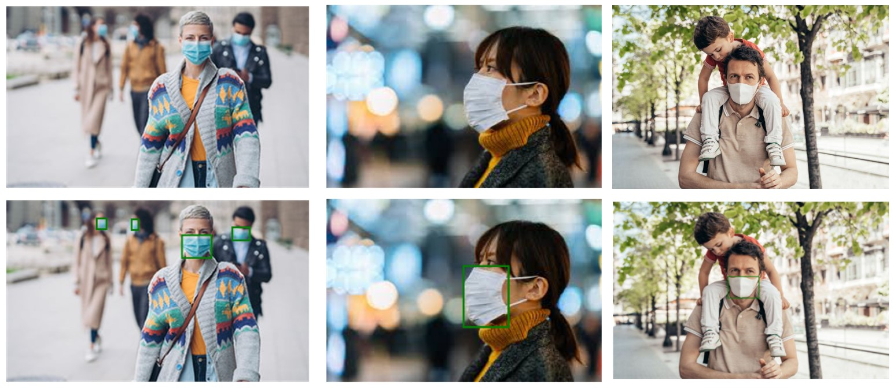
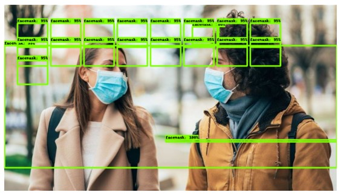
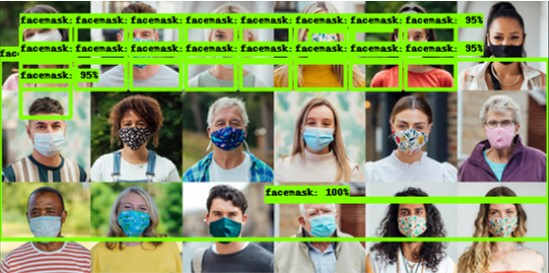
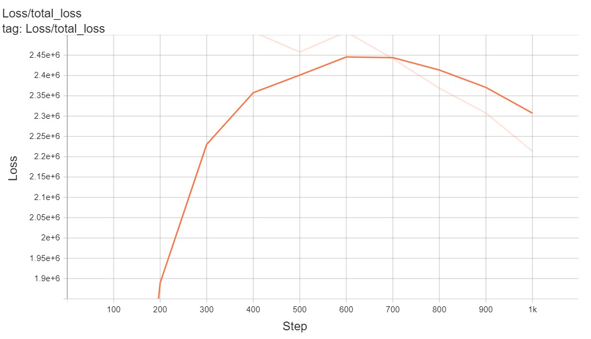

# Train TF2.x model on custom dataset <a href="https://htmlpreview.github.io/?https://raw.githubusercontent.com/SarahHannes/facemask-detection/main/facemask_detection.html">[Code]</a>

Train a pre-trained TF2.x model from <a href="https://github.com/tensorflow/models/blob/master/research/object_detection/g3doc/tf2_detection_zoo.md">Model Zoo</a> on Google colab.

## Dataset collection
A total of 40 .JPG images were collected manually from Google images with search query such as `people wearing facemask` using <a href="https://chrome.google.com/webstore/detail/image-downloader-imageye/agionbommeaifngbhincahgmoflcikhm?hl=en">Imageye</a> google chrom extension. Collected images were individually labelled using <a href="https://labelstud.io/">Label Studio</a>. Only 1 label class `facemask` is used. Label annotations were later exported as Pascal VOC XML files. For quick start, <a href="https://github.com/SarahHannes/facemask-detection/blob/main/images.zip">images</a> and its <a href="https://github.com/SarahHannes/facemask-detection/blob/main/annotations.zip">annotations</a> are accessible from the repo.

#### Example of labelled images


#### Example of an xml annotation file
```
<annotation>
	<folder>images</folder>
	<filename>78cd539a-39</filename>
	<source>
		<database>MyDatabase</database>
		<annotation>COCO2017</annotation>
		<image>flickr</image>
		<flickrid>NULL</flickrid>
		<annotator>1</annotator>
	</source>
	<owner>
		<flickrid>NULL</flickrid>
		<name>Label Studio</name>
	</owner>
	<size>
		<width>5184</width>
		<height>3456</height>
		<depth>1</depth>
	</size>
	<segmented>0</segmented>
	<object>
		<name>facemask</name>
		<pose>Unspecified</pose>
		<truncated>0</truncated>
		<difficult>0</difficult>
		<bndbox>
			<xmin>2080</xmin>
			<ymin>1899</ymin>
			<xmax>3255</xmax>
			<ymax>2697</ymax>
		</bndbox>
	</object>
</annotation>
```
## Model Architecture 
SSD MobileNet V2 pre-trained model is used as the base model. Model is trained for 1000 steps and 50 evalutation steps. Total loss at Step 1000 was 2280508. The pre-trained model's `pipeline.config` is then edited for transfer learning on the collected dataset. Settings were changed for:
```
model {
  ssd {
    num_classes: 90
    ...
    train_config {
  batch_size: 512
  ...}
  fine_tune_checkpoint: "PATH_TO_BE_CONFIGURED"
  ...
  fine_tune_checkpoint_type: "classification"
  ...
train_input_reader {
  label_map_path: "PATH_TO_BE_CONFIGURED"
  tf_record_input_reader {
    input_path: "PATH_TO_BE_CONFIGURED"
  }
}
...
eval_input_reader {
  label_map_path: "PATH_TO_BE_CONFIGURED"
...
  tf_record_input_reader {
    input_path: "PATH_TO_BE_CONFIGURED"
  }
}
```
Below is example of edited `pipeline.config`:
```
model {
  ssd {
    num_classes: 1
    ...
    train_config {
  batch_size: 1
  ...}
  fine_tune_checkpoint: ".../pre-trained-models/ssd_mobilenet_v2_320x320_coco17_tpu-8/checkpoint/ckpt-0"
  ...
  fine_tune_checkpoint_type: "detection"
  ...
train_input_reader {
  label_map_path: ".../annotations/label_map.pbtxt"
  tf_record_input_reader {
    input_path: ".../annotations/train.record"
  }
}
...
eval_input_reader {
  label_map_path: ".../annotations/label_map.pbtxt"
...
  tf_record_input_reader {
    input_path: ".../annotations/test.record"
  }
}
```

#### Prediction in test data


#### Prediction on out of sample data


#### Total loss


## Conclusion 
1. Model performance is very poor as we can observe same position of bounding boxes in all of the above predictions - may benefit from more training steps & data.
2. Experiment with other models from Model Zoo.

## Credits and useful references
- https://github.com/ansonnn07/object-detection
- https://github.com/Nkap23/TensorFlow_with_Colab_tutorial/blob/master/TensorFlow_with_Colab_tutorial.ipynb
- https://medium.com/swlh/tensorflow-2-object-detection-api-with-google-colab-b2af171e81cc
- https://github.com/Tony607/object_detection_demo
- My deep learning trainer!
